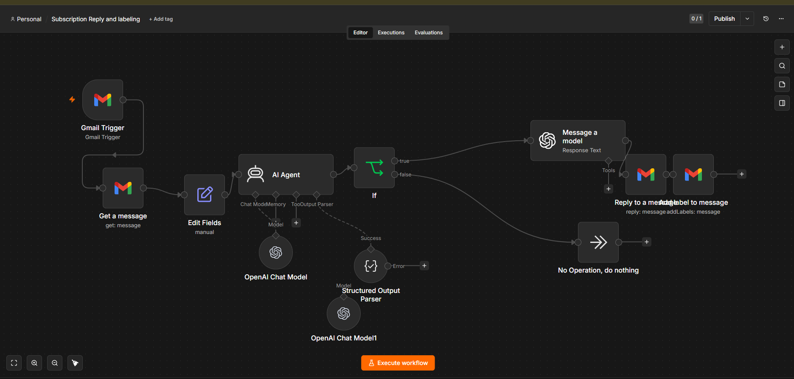
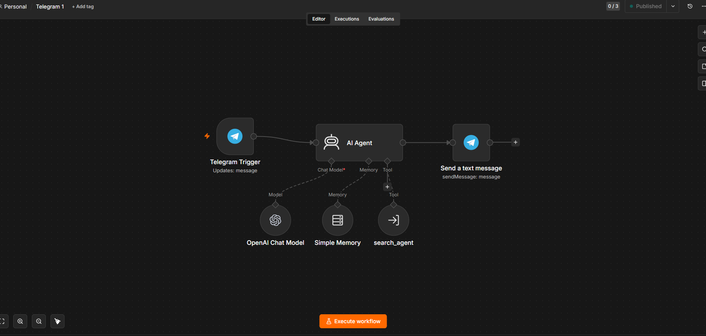
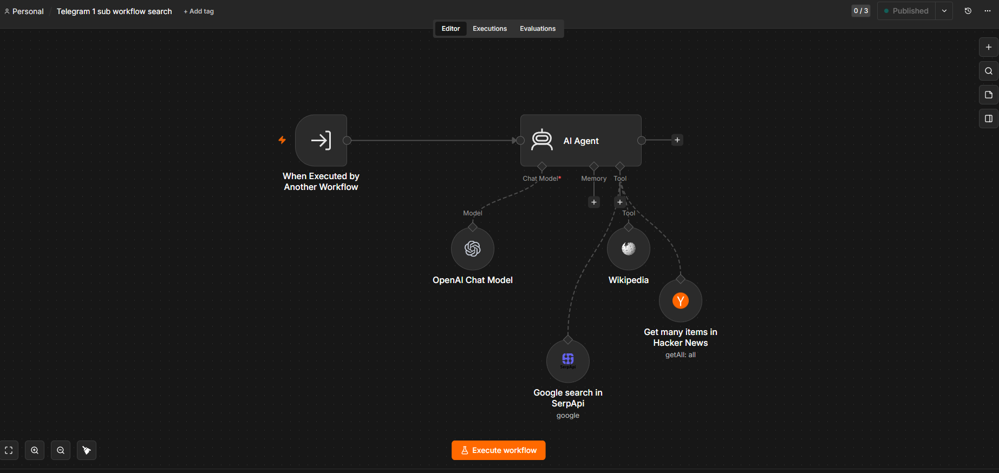
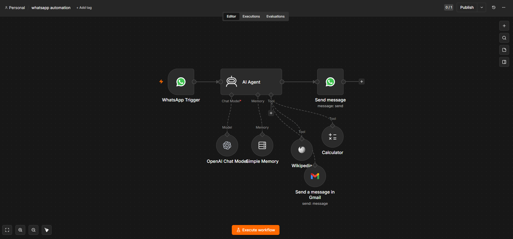

# AI Automation Assistant

AI Automation Assistant is a self-hosted n8n automation workspace for customer-style messaging, research, email triage, and multi-channel AI replies. It combines n8n workflows, OpenAI chat models, messaging integrations, search tools, and Cloudflare Tunnel hosting so the assistant can run locally on Windows while still receiving public webhooks.

The current public n8n endpoint is:

```text
https://n8n.kilokilo.top
```

The local n8n service runs at:

```text
http://localhost:5678
```

## What Is Included

```text
workflows/
  subscription-reply-and-labeling.json
  telegram-assistant.json
  telegram-search-subworkflow.json
  whatsapp-automation.json

docs/images/
  subscription-reply-and-labeling.png
  telegram-assistant.png
  telegram-search-subworkflow.png
  whatsapp-automation.png
```

These workflow JSON files are exported n8n workflows. Import them into n8n with:

```text
n8n UI -> Workflows -> Import from File
```

Credentials are intentionally not stored in this repository. After importing, reconnect the required n8n credentials inside your own n8n instance.

## Workflow Map

| Workflow | File | Status in export | Purpose |
| --- | --- | --- | --- |
| Subscription Reply and labeling | `workflows/subscription-reply-and-labeling.json` | Draft | Watches Gmail, detects subscription-related email, replies with an AI-generated message, and applies a Gmail label. |
| Telegram 1 | `workflows/telegram-assistant.json` | Published | Main Telegram bot workflow. It receives Telegram messages, sends them to an AI Agent, uses memory, can call the search sub-workflow, and replies in Telegram. |
| Telegram 1 sub workflow search | `workflows/telegram-search-subworkflow.json` | Published | Search/research helper workflow called by the Telegram assistant. It can use Wikipedia, Hacker News, and SerpApi Google Search. |
| whatsapp automation | `workflows/whatsapp-automation.json` | Draft | WhatsApp AI assistant that can answer messages, remember context, calculate, search Wikipedia, and draft/send Gmail messages. |

## Workflow Screenshots

### Subscription Reply and Labeling



This workflow starts from a Gmail trigger. It fetches the email, normalizes fields, asks an AI Agent whether the message is subscription-related, branches on the result, generates a reply when needed, sends the Gmail reply, and applies a Gmail label.

Main nodes:

- Gmail Trigger
- Get a message
- Edit Fields
- AI Agent
- OpenAI Chat Model
- Structured Output Parser
- If
- Message a model
- Reply to a message
- Add label to message

### Telegram Assistant



This is the main Telegram bot. A Telegram message triggers the workflow, the message text goes into an AI Agent, and the assistant replies back into the same Telegram chat. The workflow also includes simple memory and a tool workflow named `search_agent`, which connects to the research sub-workflow.

Main nodes:

- Telegram Trigger
- AI Agent
- OpenAI Chat Model
- Simple Memory
- `search_agent`
- Send a text message

### Telegram Search Sub-Workflow



This workflow is designed to be called by another workflow. The Telegram assistant uses it as a research tool when a question needs outside knowledge. It gives the AI Agent access to Wikipedia, Hacker News, and SerpApi-powered Google Search.

Main nodes:

- When Executed by Another Workflow
- AI Agent
- OpenAI Chat Model
- Wikipedia
- Get many items in Hacker News
- Google search in SerpApi

### WhatsApp Automation



This workflow turns WhatsApp into an AI assistant channel. It receives inbound WhatsApp messages, passes the message body to an AI Agent, remembers short-term context, and replies through WhatsApp. It also gives the agent tools for calculation, Wikipedia lookup, and Gmail sending.

Main nodes:

- WhatsApp Trigger
- AI Agent
- OpenAI Chat Model
- Simple Memory
- Send message
- Calculator
- Wikipedia
- Send a message in Gmail

## Required Accounts And Credentials

Create these credentials in n8n after importing the workflows:

| Credential | Used by | Notes |
| --- | --- | --- |
| OpenAI API | All AI Agent / OpenAI model nodes | Required for the chat models and AI responses. |
| Gmail OAuth2 | Gmail subscription workflow and WhatsApp Gmail tool | Required for reading, replying, labeling, and sending email. |
| Telegram Bot API | Telegram workflow | Create a bot with BotFather and connect the token in n8n. |
| WhatsApp Cloud API | WhatsApp workflow | Requires Meta WhatsApp Cloud API setup and webhook configuration. |
| SerpApi | Telegram search sub-workflow | Required for Google Search through SerpApi. |

Do not commit credential files, API keys, database files, or `.n8n` runtime data to the repository.

## Import Order

Import workflows in this order:

1. `workflows/telegram-search-subworkflow.json`
2. `workflows/telegram-assistant.json`
3. `workflows/subscription-reply-and-labeling.json`
4. `workflows/whatsapp-automation.json`

The Telegram assistant depends on the search sub-workflow. After importing both, open the Telegram assistant and confirm that the `search_agent` tool points to the imported search workflow.

## Hosting Overview

The hosting setup uses three pieces:

1. n8n runs locally on Windows at `http://localhost:5678`.
2. Cloudflare Tunnel exposes the local n8n instance to the internet.
3. Cloudflare DNS routes `n8n.kilokilo.top` to the named tunnel.

This keeps n8n running on the local machine while still giving Telegram, WhatsApp, Gmail, and other webhook-based integrations a stable public HTTPS URL.

## Cloudflare Tunnel Setup

The Cloudflare Tunnel is named:

```text
n8n
```

The tunnel ID is:

```text
48de26c1-7698-4ade-b482-0c40b363b5d3
```

The Windows config file lives at:

```text
C:\Users\johnn\.cloudflared\config.yml
```

Expected config:

```yaml
tunnel: 48de26c1-7698-4ade-b482-0c40b363b5d3
credentials-file: C:\Users\johnn\.cloudflared\48de26c1-7698-4ade-b482-0c40b363b5d3.json

ingress:
  - hostname: n8n.kilokilo.top
    service: http://localhost:5678
  - service: http_status:404
```

The important part is the `ingress` section. Without it, cloudflared can connect to Cloudflare but will return `503` because it does not know where to send incoming HTTP traffic.

## DNS Route

The DNS route command is:

```powershell
cloudflared tunnel route dns n8n n8n.kilokilo.top
```

If the route already exists, cloudflared will report that `n8n.kilokilo.top` is already configured to route to the tunnel. That is fine.

## Run The Tunnel

Run the tunnel with the config file:

```powershell
cloudflared tunnel --config "$env:USERPROFILE\.cloudflared\config.yml" run n8n
```

If an old tunnel process is running with `--url`, stop it and restart with the config command above. The config-file version is the one that knows about the hostname and ingress rules.

## n8n Environment Variables

Set these Windows user environment variables so n8n generates correct public webhook URLs:

```powershell
[Environment]::SetEnvironmentVariable('WEBHOOK_URL','https://n8n.kilokilo.top','User')
[Environment]::SetEnvironmentVariable('N8N_HOST','n8n.kilokilo.top','User')
[Environment]::SetEnvironmentVariable('N8N_PROTOCOL','https','User')
[Environment]::SetEnvironmentVariable('N8N_PROXY_HOPS','1','User')
```

Open a new PowerShell window after setting them, then restart n8n.

## Start n8n On Windows

Start n8n in a normal terminal:

```powershell
n8n start
```

Start n8n in the background:

```powershell
Start-Process -FilePath "powershell.exe" `
  -ArgumentList @('-NoProfile','-ExecutionPolicy','Bypass','-Command','n8n start') `
  -WindowStyle Hidden
```

If port `5678` is already in use, another n8n process is probably already running. To stop the process using the port:

```powershell
$portOwner = Get-NetTCPConnection -LocalPort 5678 -State Listen |
  Select-Object -First 1 -ExpandProperty OwningProcess

Stop-Process -Id $portOwner -Force
```

Then start n8n again:

```powershell
n8n start
```

## Verify The Setup

Check Cloudflare Tunnel config:

```powershell
cloudflared tunnel ingress validate
```

Expected result:

```text
OK
```

Check the hostname routing rule:

```powershell
cloudflared tunnel ingress rule https://n8n.kilokilo.top
```

Expected result:

```text
Matched rule #0
service: http://localhost:5678
```

Check local n8n:

```powershell
Invoke-WebRequest -UseBasicParsing http://localhost:5678
```

Check public n8n:

```powershell
Invoke-WebRequest -UseBasicParsing https://n8n.kilokilo.top
```

Both should return `200 OK`.

## Password Reset Notes

If n8n says the password is wrong and email recovery is not configured, use n8n's built-in user-management reset command.

First, stop n8n. Then create a backup of the local database:

```powershell
$stamp = Get-Date -Format 'yyyyMMdd-HHmmss'
$backupDir = Join-Path $env:USERPROFILE ".n8n\backup-$stamp"
New-Item -ItemType Directory -Path $backupDir -Force | Out-Null
Copy-Item -Path "$env:USERPROFILE\.n8n\database.sqlite" -Destination $backupDir -Force
```

Then reset the user state:

```powershell
n8n user-management:reset
```

After the reset, start n8n and create/sign in with the owner account again.

## Chrome Dangerous Site Warning

Chrome may show a red "Dangerous site" warning for `n8n.kilokilo.top`. That is a Google Safe Browsing reputation issue, not a Cloudflare Tunnel routing issue.

If `Invoke-WebRequest` returns `200 OK`, the tunnel is working. To request a review from Google, submit the URL here:

```text
https://www.google.com/safebrowsing/report_error/
```

You can check the current Safe Browsing status here:

```text
https://transparencyreport.google.com/safe-browsing/search
```

## Troubleshooting

### cloudflared returns 503

Cause: the tunnel is running without ingress rules.

Fix: make sure `C:\Users\johnn\.cloudflared\config.yml` exists and includes the `ingress` section, then run:

```powershell
cloudflared tunnel --config "$env:USERPROFILE\.cloudflared\config.yml" run n8n
```

### Cloudflare returns 502

Cause: Cloudflare reached the tunnel, but local n8n was not running at `http://localhost:5678`.

Fix:

```powershell
n8n start
Invoke-WebRequest -UseBasicParsing http://localhost:5678
```

### n8n says port 5678 is already in use

Cause: another n8n process is already running.

Fix:

```powershell
$portOwner = Get-NetTCPConnection -LocalPort 5678 -State Listen |
  Select-Object -First 1 -ExpandProperty OwningProcess
Stop-Process -Id $portOwner -Force
n8n start
```

### Telegram workflow cannot use search

Cause: the search sub-workflow was not imported first, or the tool node points to the wrong workflow.

Fix: import `telegram-search-subworkflow.json`, then open `telegram-assistant.json` in n8n and reconnect the `search_agent` tool to the imported sub-workflow.

### Gmail nodes fail

Cause: Gmail OAuth2 credentials are missing or expired.

Fix: reconnect Gmail OAuth2 in n8n credentials, then reopen the Gmail workflow and select the credential on all Gmail nodes.

## Security Checklist

- Keep n8n credentials in n8n, not in Git.
- Do not commit `.n8n/database.sqlite`.
- Do not commit Cloudflare tunnel credential JSON files.
- Use HTTPS public webhooks only.
- Keep `N8N_PROXY_HOPS=1` when running behind Cloudflare Tunnel.
- Review AI-generated email replies before fully automating production inboxes.
- Use test Telegram and WhatsApp bots before connecting real customer channels.

## Project Status

The automation workflows are exported and documented. The hosting route has been validated with Cloudflare Tunnel, and the public n8n URL is designed to route to the local n8n instance at port `5678`.

Next recommended improvements:

- Add a short demo video or GIF for each workflow.
- Add example test messages for Telegram and WhatsApp.
- Add a credentials setup checklist with screenshots.
- Add a production deployment option if the workflows move from local Windows hosting to a VPS.
